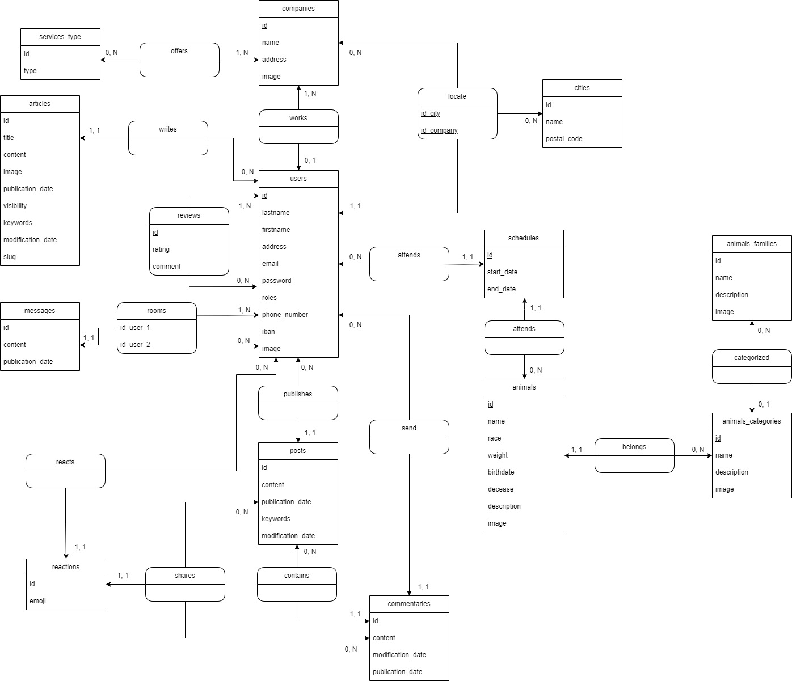

# Conception de l'application web

## Dictionnaire de données
### Table UTILISATEURS
| Données | Type | Taille | Contrainte | Obligatoire | Valeur par défaut | Détail |
|-----------|-----------|-----------|-----------|-----------|-----------|-----------|
| Nom  | Alphanumérique  | 100  | / | Oui | / | Nom de l'utilisateur |
| Prénom | Alphanumérique | 50 | / | Oui | / | Prénom de l'utilisateur |
| Date de naissance | Temporel | / | / | Non | / | Date de naissance de l'utilisateur |
| Adresse | Alphanumérique | 255 | / | Non | / | Adresse de l'utilisateur |
| Email | Alphanumérique | 100 | UNIQUE | Oui | / |  Email de l'utilisateur |
| Mot de passe | Alphanumérique | 255 | / | Oui | / | Mot de passe de l'utilisateur |
| Rôles | JSON | / | / | Oui | / | Rôles de de l'utilisateur |
| Numéro de téléphone | Alphanumérique | 20 | / | Non | / | Numéro de téléphone de l'utilisateur |
| Iban | Alphanumérique | 34 | / | Non | / | Iban de l'utilisateur |
| Image | Alphanumérique | 50 | / | Non | user_default.jpg | Image de l'utilisateur |

### Table COMPAGNIES
| Données | Type | Taille | Contrainte | Obligatoire | Valeur par défaut | Détail |
|-----------|-----------|-----------|-----------|-----------|-----------|-----------|
| Nom  | Alphanumérique  | 50  | / | Oui | / | Nom de la compagnie |
| Adresse | Alphanumérique | 100 | / | Oui | / | Prénom de la compagnie |
| Image | Alphanumérique | 50 | / | Non | compagnie_default.jpg | Image de la compagnie |

### Table AVIS
| Données | Type | Taille | Contrainte | Obligatoire | Valeur par défaut | Détail |
|-----------|-----------|-----------|-----------|-----------|-----------|-----------|
| Note  | Numérique  | /  | / | Oui | / | Notation d'un utilisateur vers un autre utilisateur |
| Commentaire | Alphanumérique | 255 | / | Non | / | Commentaire d'un utilisateur vers un autre utilisateur |

### Table FAMILLES ANIMAUX
| Données | Type | Taille | Contrainte | Obligatoire | Valeur par défaut | Détail |
|-----------|-----------|-----------|-----------|-----------|-----------|-----------|
| Nom  | Alphanumérique  | 30  | Unique | Oui | / | Le nom de la famille d'animal |
| Description | Alphanumérique | Text | / | Non | / | Description de la famille d'animal |
| Image | Alphanumérique | 50 | / | Non | animal_family.jpg | Image de la famille d'animal |

### Table CATEGORIES ANIMAUX
| Données | Type | Taille | Contrainte | Obligatoire | Valeur par défaut | Détail |
|-----------|-----------|-----------|-----------|-----------|-----------|-----------|
| Nom  | Alphanumérique  | 30  | Unique | Oui | / | Le nom de la catégorie d'animal |
| Description | Alphanumérique | Text | / | Non | / | Description de la catégorie d'animal |
| Image | Alphanumérique | 50 | / | Non | animal_family.jpg | Image de la catégorie d'animal |

### Table ANIMAUX
| Données | Type | Taille | Contrainte | Obligatoire | Valeur par défaut | Détail |
|-----------|-----------|-----------|-----------|-----------|-----------|-----------|
| Nom  | Alphanumérique  | 50  | / | Oui | / | Le nom de l'animal |
| Race | Alphanumérique | 50 | / | Non | / | Race de l'animal |
| Poids | Numérique | (4,2) | / | Non | / | Poids de l'animal |
| Date de naissance | Temporel | / | / | Non | / | Date de naissance de l'animal |
| Décès | Logique | / | / | Non | / | Est-ce que l'animal est décédé ? |
| Description | Alphanumérique | Text | / | Non | / | Description de l'animal |
| Image | Alphanumérique | 50 | / | Non | animal_categorie.jpg | Image de l'animal |

### Table ARTICLES
| Données | Type | Taille | Contrainte | Obligatoire | Valeur par défaut | Détail |
|-----------|-----------|-----------|-----------|-----------|-----------|-----------|
| Titre | Alphanumérique | 40 | UNIQUE | Oui | / | Titre de l'article |
| Contenu | Alphanumérique | Text | / | Oui | / | Contenu de l'article |
| Image | Alphanumérique | 50 | / | Non | / | Image de l'article |
| Date de publication | Temporel | / | / | Oui | now() | Date de publication de l'article |
| Visibilité | Logique | / | / | Non | false | L'article est-il visible ? |
| Mots-clés | Alphanumérique | 50 | / | Non | / | Mots-clés de l'article |
| Date de modification | Temporel | / | / | Non | / | Date de modification de l'article |
| Slug | Alphanumérique | 50 | UNIQUE | Oui | / | Url de l'article |

### Table POSTS
| Données | Type | Taille | Contrainte | Obligatoire | Valeur par défaut | Détail |
|-----------|-----------|-----------|-----------|-----------|-----------|-----------|
| Contenu | Alphanumérique | Text | / | Oui | / | Contenu du post |
| Date de publication | Temporel | / | / | Oui | now() | Date de publication du post |
| Mots-clés | Alphanumérique | 50 | / | Non | / | Mots-clés du post |
| Date de modification | Temporel | / | / | Non | / | Date de modification du post |

### Table COMMENTAIRES
| Données | Type | Taille | Contrainte | Obligatoire | Valeur par défaut | Détail |
|-----------|-----------|-----------|-----------|-----------|-----------|-----------|
| Contenu | Alphanumérique | Text | / | Oui | / | Contenu du post |
| Date de publication | Temporel | / | / | Oui | now() | Date de publication du post |
| Date de modification | Temporel | / | / | Non | / | Date de modification du post |

### Table MESSAGES
| Données | Type | Taille | Contrainte | Obligatoire | Valeur par défaut | Détail |
|-----------|-----------|-----------|-----------|-----------|-----------|-----------|
| Contenu | Alphanumérique | Text | / | Oui | / | Contenu du message |
| Date de publication | Temporel | / | / | Oui | now() | Date de publication du message |
| Date de modification | Temporel | / | / | Non | / | Date de modification du message |

### Table AGENDA
| Données | Type | Taille | Contrainte | Obligatoire | Valeur par défaut | Détail |
|-----------|-----------|-----------|-----------|-----------|-----------|-----------|
| Date de début | Temporel | / | / | Oui | / | Date de début de la prise de RDV |
| Date de fin | Temporel | / | / | Oui | / | Date de fin de la prise de RDV |

### Table TYPE SERVICES
| Données | Type | Taille | Contrainte | Obligatoire | Valeur par défaut | Détail |
|-----------|-----------|-----------|-----------|-----------|-----------|-----------|
| Nom | Alphanumérique | 30 | / | Oui | / | Nom du service Ex: Petsitter, Véto etc... |

### Table RÉACTIONS
| Données | Type | Taille | Contrainte | Obligatoire | Valeur par défaut | Détail |
|-----------|-----------|-----------|-----------|-----------|-----------|-----------|
| Emoji | Alphanumérique | 50 | / | Oui | / | Type d'emoji de la réaction |

### Table VILLES
| Données | Type | Taille | Contrainte | Obligatoire | Valeur par défaut | Détail |
|-----------|-----------|-----------|-----------|-----------|-----------|-----------|
| Code Postal | Alphanumérique | 10 | / | Oui | / | Code postal de la ville |
| Nom | Alphanumérique | 50 | / | Oui | / | Nom de la ville |

## Diagrammes MERISE
### MCD
